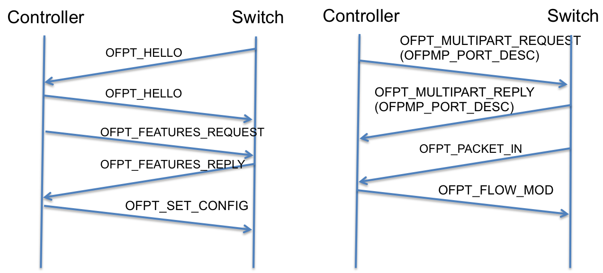
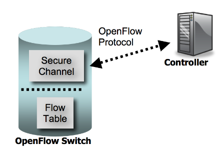
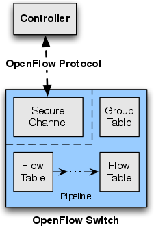
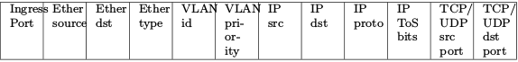
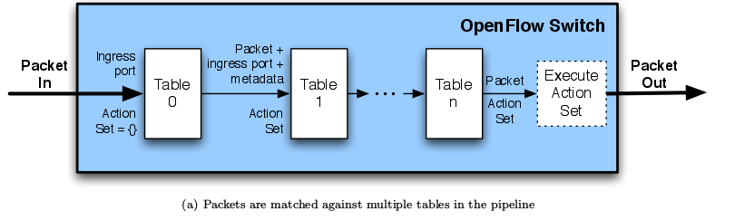
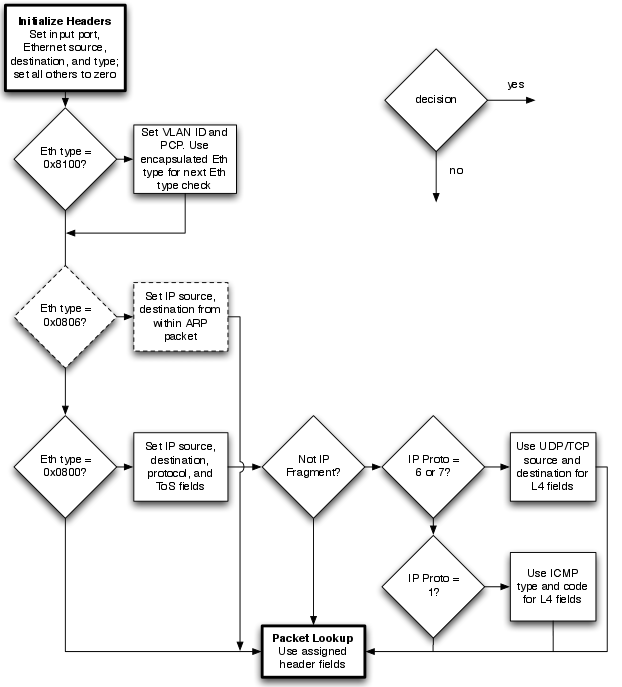
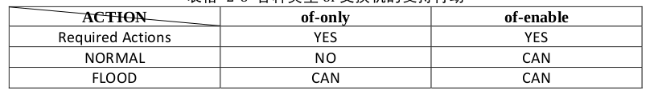
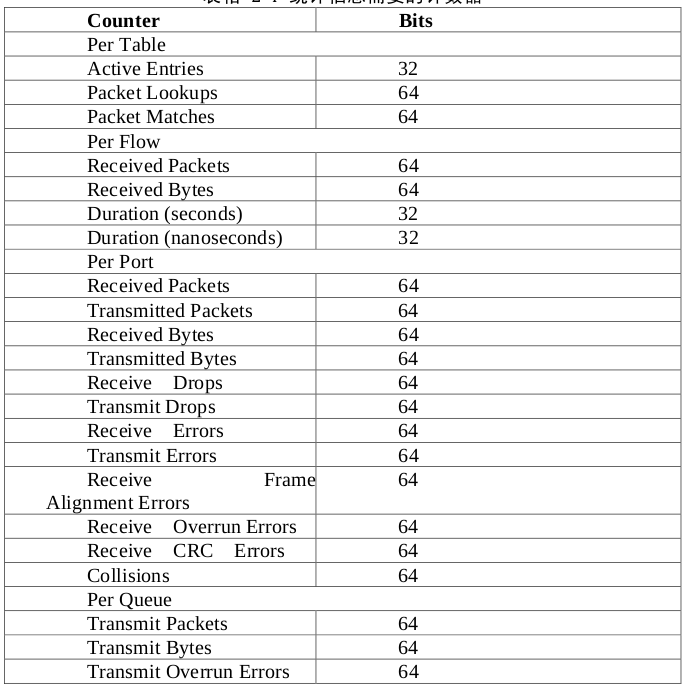

openflow to understand
================
wirte in ChengDu
19 Aug 2015

openflow 本身的内容还是很多的，最好的学习方式还是去官网查看白皮书吧。当然我这个东西感觉也有翻译openflow官网文档的嫌疑哈。我写它的最大目的是为了理清自己的思路，按照自己的思路串接。还有就是纪念自己在公司实习的这几个月，学到了很多东西仅此冰山一角，哈哈^^。

##什么是openflow

openflow是斯坦福大学一位教授在控制交换机的时候觉得很不方便，开发出来的控制交换机的协议。在很多方面openflow和tcp有许多异曲同工之处，例如我们的tcp要建立连接的过程是三次握手实现的，而我们的openflow在建立交换机与控制器之间的连接的时候也是使用类似于这样的方式实现的。

例如下图：

(ps:这个消息类型是openflow 1.3版本的)

在controller和switch之间的通信通过openflow不同的消息类型获取以及确认，和TCP的三次握手感觉很像。但是openflow比tcp有更多功能。

下面继续说我们的openflow
请看这张十分著名的图：

这个图也可以是这样子的：

可以看到三个比较关键的地方：

1、openflow switch

2、openflow协议

3、controller控制器

概念认识
这三个和我们传统的认识里面又有些什么不一样的地方多了些什么那？

###openflow switch

####flow table
首先，我们的openflow switch和我们一般的交换机相比较的不同在于多了flow table。这个flow table在和传统的相比较可以类似于我们的路由表，我们的路由表是一个包到达路由器了，查询路由表找到它的下一跳。我们的flow table也是这么一个查询匹配的过程，而无法成功匹配的包类似于路由器会走默认路由一样，我们的flow table无法成功匹配的包就会走到我们的controller控制器里面，如果flow table为空的化，就像一个空的路由表一样，当然所有的包就会走到controller上去啦。(如果controller再无法匹配的化，就丢包吧～)

那么问题来了，我们知道路由表是路由信息下一跳信息构成的，那么我们的flow table怎么构成，怎么匹配的数据包那？

然后来看看flow table的构成：

| Header Fields | Counters | Actions |

(ps:很多地方也把Actions 叫做Instructions)

三大金刚

简单说这三大金刚分别是干什么的？

#####Header fields

header fields:包头域匹配我们的包，这个包头域和我们一般的数据包格式也是不一样的：
有十二个部分组成，由如下的内容组成：

对于这个包头域里面的内容更加详细的解读可以查看openflow的白皮书，留下个链接好了，方便自己迷惑的时候看看
[openflow 1.0 white paper](http://archive.openflow.org/documents/openflow-spec-v1.0.0.pdf)

这个只是包头域的组成而以，但是我们的包怎么匹配的那？还是根据下面这个进行的匹配。

在这个过程中看到我们的包是按照flow table来一个一个的匹配的这个是整体的，还有更加具体细节的包头匹配的过程，如下图所示：

包头域能够成功匹配了之后就是执行我们相应的action的动作了。而我们的action又有区分，分为必须行动和可选行动，这个就不需要解释字面意思就能够懂了。

#####Action

a、必备行动

其中必备行动例如转发(forward)，丢弃(drop)。
例如在forward里面又有诸如：ALL，CONTROLLER，LOCAL，TABLE，IN_PORT等等内容，每个动作有每个动作的作用，ALL=转发到所出口(不包括入口)

b、可选行动

可选行动包括：转发、入队、修改域；修改域里面又有设置VLAN ID，设置VLAN优先级等等。

白皮书和openflow spec上对于这些Action的解释都很多了，就不再重复。(ps:详细理解对于控制包，控制交换器非常好哦)

因为Action的不同又要再次引出一个不同于传统的概念，那就是不同的交换机的类型。openflow switch有两种类型of-only(纯of交换机)和of-enable(支持of交换机)，这两个交换机的不同在于他们支持的Action不同，得到如下表格：

这样我们就大致清楚我们的其中两大金刚是干什么的了，接下来还有一个金刚那就是是Counters计数器的作用了。

#####Counters

counters最主要的作用就是可以针对每张表，每个流，每个端口，每个队列来维护。来统计流量的信息，例如表项，查找次数，发送包数等，这里有一张表可以看到完整的信息：

###Channel
到此为止，基本上openflow switch上的内容基本上就这些了下面我们看看，openflow协议。
开篇就介绍过openflow是什么，在我们整个的体系当中我们的channel就是通过openflow建立的，现在要建立这个channel的已经不止openflow这个协议了，还有许多其他的协议都可以建立控制。

诸如开篇的那个建立链接的图，我们的channel就是这样子建立起来的，还有许多的消息类型以及子消息类型什么的，因为白皮书上有了，不想写了^^

###Controller

这个没什么好说的，常见的controller的操作系统有nox和pox等等

##对openflow的应用

说了那么多openflow，我们现在来看看怎么应用吧，做一个简单的小试验见识一下。
我们需要的软件：niminet,pox
niminet是一个轻量级软件定义网络的研发测试平台可以让他始终连接指定的controller。使用也方便，现在许多的ubuntu系统集成了的，直接apt-get install 安装就行。

pox也是一个轻量级的controller操作系统是nox更年轻一点的兄弟，而且我个人比较偏爱pox安装简便，使用方便我当然选它。哈哈

###实例：
建立一个小型网络，一个交换机，两台实例

1、启动niminet

执行命令<code>mn --controller=remote,ip=127.0.0.1,port=6666</code>

然后可以执行命令<code>dump</code>查看到这个虚拟网络环境中的信息

(ps: 在niminet里面可以通过<code>node cmd</code>来操作我们的虚拟网络，niminet里面也可以自定义拓扑图)

2、启动pox

接下来我们可以在另外一个终端里面开启我们pox,即开启我们的controller:
进入我们的pox目录，执行命令
<code>./pox.py openflow.of_01 --address=127.0.0.1 --port=6666 pox.forwarding.l2_pairs</code>

提示得到<code>INFO:core:POX 0.2.0 (carp) is up.
INFO:openflow.of_01:[00-00-00-00-00-01 1] connected</code>
一般默认的pox的端口为6633当然在这里我们也可以自己定义指定为6666。然后我们看到pox.forwarding.l2_pairs的意思是执行在pox目录下再下一级forwarding里面的l2_pairs组件。该组建就是抽取packet-in中的dst_mac和src_mac，根据源和目的端口发送flow entry到switch里面

再在niminet里面可以先让h1 ping h2   然后再执行命令<code>dpctl dump-flows</code>就可以看到openflow的规则了。

在这个环境中openflow switch里面的flow table貌似都是空的，没什么可以匹配的，就直接给了controller。在pox目录下的forwarding目录下有一些组件，对于这个还木有很清楚明白，具体怎么控制交换机还是不清楚。只写了我自己知道的内容还有很多需要继续研究^^

