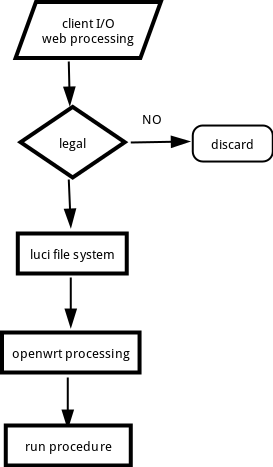

时间过的真快，快九个月了，距离上一篇博客，哈哈。九个月的时间发生了好多事情，经历了考研失败，重新工作，即将面临的是毕业，毕业之后怎样的人生在等着我那，我也不知道。对未来充满了思考。
今天重新更新了一个博客模版，moon，哈哈，因为最近好喜欢杀shengshe。


# Luci

什么是luci那，简单的说就是OpenWrt系统+lua的文件系统。OpenWrt最为目前最为流行的路由器固件制作系统受到广大的开源爱好者的喜爱。而lua作为目前十分轻量级的脚本语言也受到广大程序猿的欢迎。轻量级的lua和需要节省内存的OpenWrt系统结合的简直天衣无缝。


## OpenWrt
OpenWrt 作为基于linux的一款开源项目，可以制作智能路由器固件，在笔者看来许多地方都是相似的，许多理念方法甚至可以说是一样的。像Linux，Android等，不但有自己原本的东西。许多开发者也是乐此不疲的开发出了许多第三方的ipk包满足自己的定制化需求。简单说OpenWrt可以说是在linux的基础上增加了许多的ipk包，可以满足无线路由器的基本需求。除此之外，研发者可以定制化自己需要的功能。


## lua
lua是作为一种类C语言的脚本出现的，lua现在不仅仅运用在OpenWrt上。也很多用在网页架构上。lua的优势在于它是非常轻量级的，只有一百多kb。


# Luci实现过程


## 流程图





luci文件系统的流程是，首先在OpenWrt系统的web前端获取到用户的输入参数，web进程将这些参数进行一些处理之后传递给OpenWrt后台的lua脚本处理（当然这里是有api接口进行的参数传递），lua脚本将这些合法的用户参数写入luci配置文件中，一般是在目录```/etc/config```下。在lua将参数写入配置文件的同时，lua还会去启动一些OpenWrt系统下的启动脚本。一般在目录```/etc/init.d```下，启动脚本的同时，脚本回去读luci的配置文件参数，使进程按照用户的需求去执行。

以上就是简单的OpenWrt中的luci文件系统流程，（写的如此简单，哈哈）


