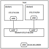

在了解了docker的一般使用规则之后，笔者再次较为深入的研究了docker的桥接模式

## 桥接模式工作原理

### 在我们创建docker应用之后，docker会自动在我们的宿主机上生成一个docker0的网卡，可以认为该网卡是所有docker容器的管理网卡，然后一般会为这个网卡生成一个内网IP地址，并且在之后容器的创建中为容器分配该网段的地址。

## 桥接模式具体工作流程

桥接模式网络拓扑图:

在每个容器创建之后，docker会为容器自动分配一对虚拟网卡，veth pair设备。该设备会桥接到docker0的网卡上，类似于OVS的交换机原理。在这个通道中进行所有的信息传输。
一般为容器分配的网卡为eth0，主机分配的网卡为veth*。容器在桥接模式下创建成功之后，我们在宿主机上<code>ifconfig</code>命令就可以看到了。

## 通信流程
现在我们大致知道了，是在怎样的虚拟网卡中开始我们的通信。然后就是具体的通信流程。

* 假设我们的容器需要ping谷歌的IP地址，是怎么做到的那？
首先，在我们的容器中除了有网卡eth0,然后会在我们的容器中生成默认路由，到主机docker0.ICMP包根据默认路由到达docker0.docker0再根据本机SNAT规则将包转发给外网网卡，最终将包转发出去。

