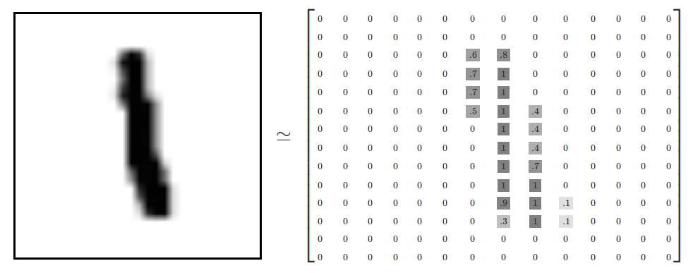

tensorflow easy notes
================
wirte in ChengDu
11 May 2018

tensorflow 作为当下最火的深度学习框架，google的开源框架，许多人入门都是从这里起航。最近在帮忙做的项目刚好也是人工智能方面的，和小伙伴一起预研出了两个demo。简单整理一下最近的预研笔记。

## tensorflow

一般在学习一个新事物的时候我们都需要去定义这个事物，先搞清楚他是什么。

tensorflow是一个使用数据流图即使来进行数值计算的开源软件库。即时有向图中的数值计算过程，是一种将计算表示成图的编程系统。

###在学习tensorflow的过程中我们需要问自己下面几个问题：

- 如何将计算流程表示成图；
- 如何通过sessions来执行图的计算
- 如何将数据表示成tensors（张量，简单理解就是多维数组）；
- 如何使用variables来保持状态信息；
- 分别使用feeds和fetches来填充数据和抓取任意的操作结果。

####回答上面的问题
- 图的创建--->施工（类比），默认的图，有三个节点，两个Constans()ops,和一个matmul()op
- 执行阶段--->session的执行,最后这些节点会在计算设备上执行（cpu,gpu）
- tensor是tensorflow中的数据结构，在计算图中的节点之间进行传递，一个tensorflow有固定的类型、级别和大小。
- 变量：一般神经网络中的参数作为变量，在计算的过程中对变量进行操作
- fetches：抓取ops的输出，所有的tensors的输出都是连贯的。feeds:一般的feeds都是在占位符占位之后，在实际的运算中需要填充了，将数据填充进去

###来看一个简单的代码
曲线拟合
这个是我们初中就会的一个函数y=kx+b
我们已经知道了我们的k=0.1,b=0.3
现在我们要用tensorflow来得到k和b的数值，新建立一个新的函数y=wx+b
现在就是训练出w和b的数值问题。

```

#简化调用库名
import tensorflow as tf
import numpy as np

#模拟生成100对数据对, 对应的函数为y = x * 0.1 + 0.3
x_data = np.random.rand(100).astype("float32")
y_data = x_data * 0.1 + 0.3

#指定w和b变量的取值范围（注意我们要利用TensorFlow来得到w和b的值）
W = tf.Variable(tf.random_uniform([1], -1.0, 1.0))
b = tf.Variable(tf.zeros([1]))
y = W * x_data + b

#最小化均方误差
loss = tf.reduce_mean(tf.square(y - y_data))
optimizer = tf.train.GradientDescentOptimizer(0.5)
train = optimizer.minimize(loss)

#初始化TensorFlow参数
init = tf.initialize_all_variables()

#运行数据流图（注意在这一步才开始执行计算过程）
sess = tf.Session()
sess.run(init)

#观察多次迭代计算时，w和b的拟合值
for step in xrange(201):
    sess.run(train)
    if step % 20 == 0:
        print(step, sess.run(W), sess.run(b))

#最好的情况是w和b分别接近甚至等于0.1和0.3

```

###tensorflow的helloworld
就像学习任何一门编程语言我们倾向于先写出一个hello world一样
在tensorflow中的hello world就是识别手写数字mnist。具体的操作和代码就不提了，网上很多，在这里给自己记个笔记，这篇博客写的很好，个人感觉比tensorflow的中文教程更容易理解一点
[mnist教程](http://www.jeyzhang.com/tensorflow-learning-notes.html)


####下面简单说一些自己的理解
#####数据表示
将手写图片表示成二维数组的形式，其中白色的位置都统一0，根据灰度的深浅来表示他趋近于1的概率


#####模型的训练
模型的训练在于概率分布和真实分布的一个符合程度，可以选择一个代价函数（或损失函数）来指示训练模型的好坏。


