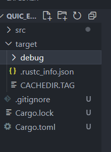
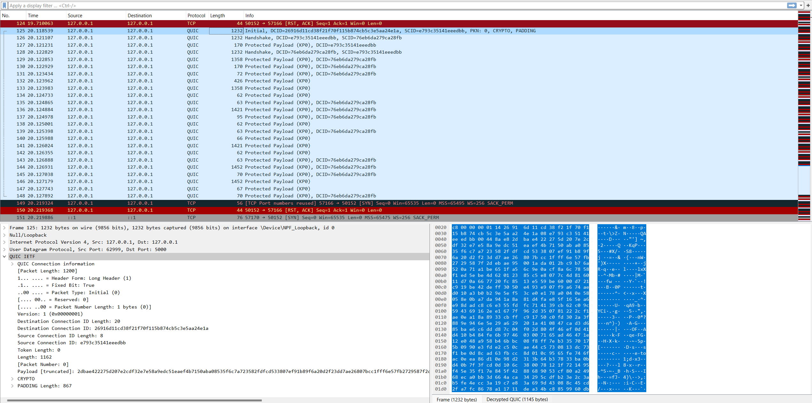

Rust实现quic网络协议
================
wirte in ChengDu
03 July 2024

## 开始
最近在学习rust语言和quic网络协议，刚好将两者结合写一个小小的demo，主要使用quinn包实现；

### 新建rust项目
* 在工作目录下新建cargo项目
* ```cargo new quic_example```
采用cargo命令行创建rust代码项目，cargo工具将自动创建相关依赖文件和目录如下所示：


### 添加quinn依赖
* 在目录结构下找到```Cargo.toml```文件，此文件为整个项目的依赖项配置信息文件，添加项目所需的依赖，```quinn```和```tokio```,修改文件内容如下：
* 
```yaml
[dependencies]
quinn = "0.10.2"
tokio = { version = "1", features = ["full"]}
rustls = { version = "0.21.0" ,features = ["dangerous_configuration"]}
rcgen = "0.11.1"
```

  
### server端代码
```

// src/server.rs

use std::{error::Error, net::SocketAddr, sync::Arc};
use quinn::{Endpoint, ServerConfig};


// Runs a QUIC server bound to given address.
pub async fn run_server(addr: SocketAddr) {
    let (endpoint, _server_cert) = make_server_endpoint(addr).unwrap();
    // accept a single connection
    let incoming_conn = endpoint.accept().await.unwrap();
    let conn = incoming_conn.await.unwrap();
    println!(
        "[server] connection accepted: addr={}",
        conn.remote_address()
    );
    loop {
        match conn.accept_bi().await {
            Ok((_send_stream, mut recv_stream)) => {
                println!("[server] stream accepted: {}", recv_stream.id());
                tokio::spawn(async move {
                    loop {
                        let mut buffer = vec![0u8; 1024 * 8];
                        match recv_stream.read(&mut buffer).await {
                            Ok(x) => match x {
                                Some(_) => {}
                                None => {
                                    println!("[server] stream closed");
                                    break;
                                }
                            },
                            Err(e) => {
                                println!("[server] read error: {}", e);
                                break;
                            }
                        }
                    }
                });
            }
            Err(e) => {
                println!("[server] connection error: {}", e);
                break;
            }
        }
    }
}


#[allow(unused)]
pub fn make_server_endpoint(bind_addr: SocketAddr) -> Result<(Endpoint, Vec<u8>), Box<dyn Error>> {
    let (server_config, server_cert) = configure_server()?;
    let endpoint = Endpoint::server(server_config, bind_addr)?;
    Ok((endpoint, server_cert))
}

/// Returns default server configuration along with its certificate.
fn configure_server() -> Result<(ServerConfig, Vec<u8>), Box<dyn Error>> {
    let cert = rcgen::generate_simple_self_signed(vec!["localhost".into()]).unwrap();
    let cert_der = cert.serialize_der().unwrap();
    let priv_key = cert.serialize_private_key_der();
    let priv_key = rustls::PrivateKey(priv_key);
    let cert_chain = vec![rustls::Certificate(cert_der.clone())];
 
    let mut server_config = ServerConfig::with_single_cert(cert_chain, priv_key)?;
    let transport_config = Arc::get_mut(&mut server_config.transport).unwrap();
    transport_config.max_concurrent_uni_streams(0_u8.into());
 
    Ok((server_config, cert_der))
}
```

### client端代码
```

// src/client.rs

use std::{error::Error, net::SocketAddr, sync::Arc};
use quinn::{Endpoint, ClientConfig};


pub async fn run_client(server_addr: SocketAddr) -> Result<(), Box<dyn Error>> {
    let mut endpoint = Endpoint::client("127.0.0.1:0".parse().unwrap())?;
    endpoint.set_default_client_config(configure_client());
 
    // connect to server
    let connection = endpoint
        .connect(server_addr, "localhost")
        .unwrap()
        .await
        .unwrap();
    println!("[client] connected: addr={}", connection.remote_address());
 
    let (mut send_stream1, _recv_stream) = connection.open_bi().await?; // added mut keyword
    send_stream1.set_priority(0)?;
    let (mut send_stream2, _recv_stream) = connection.open_bi().await?;
    send_stream2.set_priority(2)?;
    send_stream1.write_all("buf1".as_bytes()).await.unwrap();
    send_stream2.write_all("buf2".as_bytes()).await.unwrap();
 
    send_stream1.finish().await.unwrap();
    if let Err(e) = send_stream2.finish().await {
        println!("[client] stream finish error: {}", e);
    }
 
    connection.close(0u32.into(), b"done");
    // Dropping handles allows the corresponding objects to automatically shut down
    //drop(connection);
    // Make sure the server has a chance to clean up
    endpoint.wait_idle().await;
 
    Ok(())
}

fn configure_client() -> ClientConfig {
    let crypto = rustls::ClientConfig::builder()
        .with_safe_defaults()
        .with_custom_certificate_verifier(SkipServerVerification::new())
        .with_no_client_auth();
 
    ClientConfig::new(Arc::new(crypto))
}

struct SkipServerVerification;
 
impl SkipServerVerification {
    fn new() -> Arc<Self> {
        Arc::new(Self)
    }
}

impl rustls::client::ServerCertVerifier for SkipServerVerification {
    fn verify_server_cert(
        &self,
        _end_entity: &rustls::Certificate,
        _intermediates: &[rustls::Certificate],
        _server_name: &rustls::ServerName,
        _scts: &mut dyn Iterator<Item = &[u8]>,
        _ocsp_response: &[u8],
        _now: std::time::SystemTime,
    ) -> Result<rustls::client::ServerCertVerified, rustls::Error> {
        Ok(rustls::client::ServerCertVerified::assertion())
    }
}
```


### main函数调用服务
```

// src/main.rs
use std::error::Error;

mod server;
mod client;

// fn main() {
//     std::thread::spawn(|| {
//         server::main();
//     });
//     std::thread::sleep(std::time::Duration::from_secs(1));

//     client::main();
//     //println!("Hello, world!");
// }

// use tokio::io::AsyncWriteExt;
 
#[tokio::main]
async fn main() -> Result<(), Box<dyn Error>> {
    // server and client are running on the same thread asynchronously
    let addr = "127.0.0.1:5000".parse().unwrap();
    tokio::spawn(server::run_server(addr));
    client::run_client(addr).await?;
    Ok(())
}

 

 
#[allow(unused)]
pub const ALPN_QUIC_HTTP: &[&[u8]] = &[b"hq-29"];
```

### 运行代码
* 首次运行时，将根据依赖包进行下载，下载成功后执行main.rs
```
PS D:\personal\quic_example> cargo run
warning: both `C:\Users\eileench\.cargo\config` and `C:\Users\eileench\.cargo\config.toml` exist. Using `C:\Users\eileench\.cargo\config`
   Compiling rustls v0.21.12
   Compiling powerfmt v0.2.0
   Compiling num-conv v0.1.0
   Compiling time-core v0.1.2
   Compiling base64 v0.22.1
   Compiling deranged v0.3.11
   Compiling pem v3.0.4
   Compiling time v0.3.36
   Compiling yasna v0.5.2
   Compiling rcgen v0.11.3
   Compiling quinn-proto v0.10.6
   Compiling quinn v0.10.2
   Compiling quic_example v0.1.0 (D:\personal\quic_example)
warning: unused import: `tokio::io::AsyncWriteExt`
  --> src/main.rs:23:5
   |
23 | use tokio::io::AsyncWriteExt;
   |     ^^^^^^^^^^^^^^^^^^^^^^^^
   |
   = note: `#[warn(unused_imports)]` on by default

warning: `quic_example` (bin "quic_example") generated 1 warning
    Finished `dev` profile [unoptimized + debuginfo] target(s) in 34.77s
     Running `target\debug\quic_example.exe`
[client] connected: addr=127.0.0.1:5000
[server] connection accepted: addr=127.0.0.1:54697
[server] stream accepted: client bidirectional stream 0
[server] stream accepted: client bidirectional stream 1
[server] stream closed
[server] stream closed
[server] connection error: closed by peer: done (code 0)
```

### 抓包查看quic网络报文
打开本地wireshark进行抓包分析:



